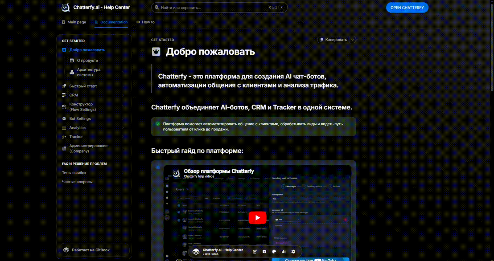

# Как пользоваться Help Center

> ### Help Center — это база знаний по Chatterfy, где вы можете быстро найти ответы на любые вопросы по платформе.

### Поиск с AI


Верхней части сайта находится поисковая строка с AI-ответами.

*

    
<figure><figcaption></figcaption></figure>

Просто введите любой вопрос, например:

* как создать бота
* как настроить трекер
* как работает Flow

AI подберёт релевантные статьи и сразу даст краткий ответ.


### Навигация по разделам


Все статьи в Help Center разбиты по разделам:

*

    
<figure><figcaption></figcaption></figure>

* Добро пожаловать — вводная информация о платформе
* Быстрый старт — базовая настройка и первые шаги
* CRM — работа с лидами и чатами
* Конструктор (Flow Settings) — создание и логика воронок
* Bot Settings — настройки бота
* Analytics — аналитика и отчёты
* Tracker — кампании, источники и события
* Администрирование (Company) — управление аккаунтом и доступами

Вы можете перейти в нужный раздел и найти статью вручную.


### Как быстрее находить нужное


* Используйте конкретные запросы (например: _postback настройка facebook_)
* Переходите по подсказкам из AI-ответа
* Открывайте связанные статьи внутри страниц



