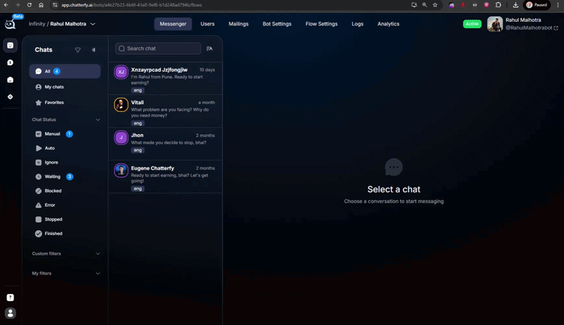

# Как перезапустить воронку?


Переписка с ботом с самого начала начнется только в том случае, если Вы очистите диалог в CRM. То есть только если Вы предварительно перейдете в карточку клиента, спуститесь вниз до кнопки Clear Chat и нажмете на нее.\
В ином случае, если человек с неочищенным чатом нажмет /start, то переписка не начнется с первого шага.

*

    
<figure><figcaption></figcaption></figure>



<a href="./" class="button secondary">Частые вопросы</a>
