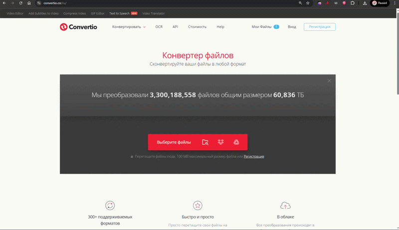

# Нет визуализации в голосовых сообщениях

> ### Голосовые cообщения отправляется пустыми (без визуализации громкости звука) почему так происходит ?


Голосовые сообщения необходимо загружать в формате .ogg с кодеком opus

*

    
<figure><figcaption></figcaption></figure>



<a href="./" class="button secondary">Частые вопросы</a>
