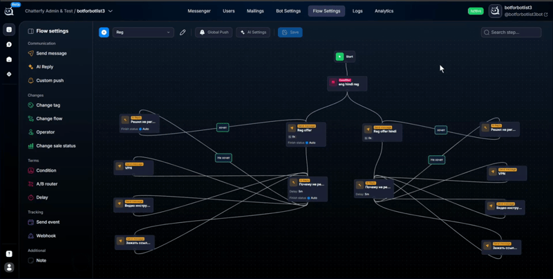

# Почему ИИ не пропускает если лид дал ответ


В блоке AI Reply нужно указать галочку Skip transition blocking on first run - тогда ИИ не будет генерировать сообщения в случае, если ответ от лида получился подходящий под роутинги

*

    
<figure><figcaption></figcaption></figure>



<a href="./" class="button secondary">Частые вопросы</a>
