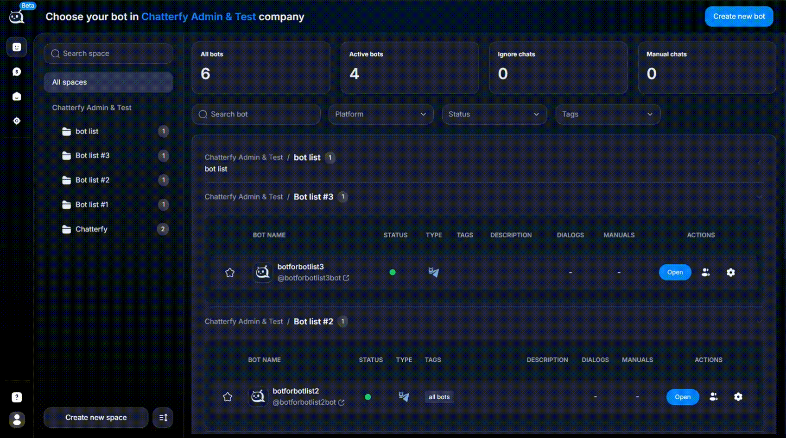

# Управление пользователями внутри Space

Раздел нужен для управления участниками конкретного **Space**.

Здесь вы добавляете пользователей, назначаете им роли и управляете доступом к CRM и ботам.

### Как это работает

Если пользователя ещё нет в компании, сначала [пригласите его](../users/kak-priglasit-polzovatelei.md).

Основной экран показывает список участников Space и их роли.

Доступ к CRM и ботам появляется только после добавления в Space.

Роль на уровне компании и роль внутри Space работают отдельно.

Одного и того же пользователя можно добавлять в разные Spaces с разными ролями.

### Где находится

<figure><figcaption></figcaption></figure>

Откройте **Company → Spaces → выберите нужный Space**.

### Что можно сделать

* добавить нового участника в Space
* назначить или изменить роль
* ограничить доступ к разделам Space
* удалить участника из Space

### Как добавить пользователя в Space

Ниже показан базовый порядок добавления пользователя.

<figure><figcaption></figcaption></figure>

<figure><figcaption></figcaption></figure>

<figure><figcaption></figcaption></figure>

<figure><figcaption></figcaption></figure>

#### Шаги

1. Откройте нужный **Space**.
2. Нажмите **Add user**.
3. Выберите пользователя из списка.
4. Назначьте роль в **Space**.

### Примечания

* Права, выданные в Space, действуют только внутри этого Space.
* Они не меняют роль пользователя на уровне компании.

### Роли в Space

<figure><figcaption></figcaption></figure>

Ниже перечислены роли, которые можно выдать пользователю внутри Space.

#### Owner

Создатель Space.

**Права:**

* полный доступ ко всем разделам Space
* управление участниками и их ролями

#### Admin

Администратор Space.

**Права:**

* полный доступ внутри Space
* управление участниками Space

**Ограничения:**

* не может удалить владельца Space — **Owner**

#### Manager

Роль для руководителей и аналитиков.

**Права:**

* управление CRM внутри Space
* настройка ботов
* создание и редактирование скриптов продаж

**Ограничения:**

* не имеет доступа к разделу **Logs**
* не может удалять диалоги
* не может скачивать диалоги

#### Operator

Роль для сотрудников, которые общаются с лидами.

**Права:**

* работа с чатами

**Ограничения:**

* нет доступа к настройкам ботов
* нет доступа к скриптам продаж
* нет доступа скачивать диалоги и удалять диалоги

#### Hide Operator

Оператор с анонимизацией данных лида.

**Особенности:**

* имя лида заменяется на `ChatterfyID`
* скрывается `USERNAME`

#### Controller

Роль для контроля качества.

**Права:**

* просмотр и анализ чатов
* просмотр статистики по операторам

#### Viewer

Роль только для просмотра.

**Ограничения:**

* нельзя отправлять сообщения
* нельзя менять настройки


