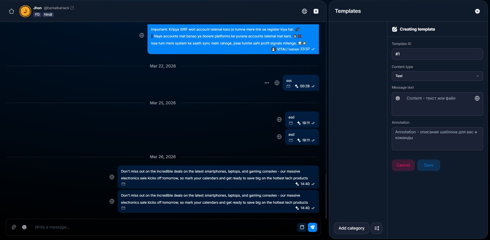

# Templates

_Templates_ — это быстрые шаблоны сообщений для ускорения работы операторов.

### Как это работает

Шаблоны вызываются через ввод `#` в чате.

**Add Category** создаёт категорию. Количество категорий не ограничено.

### Категории

С категориями можно:

* переименовывать их
* удалять их вместе со всеми шаблонами внутри
* менять их порядок через **Enable drag and drop**

### Импорт шаблонов

Кнопка **Import Templates** импортирует шаблоны из другого бота.

<figure><figcaption></figcaption></figure>

### Как создать шаблон

#### 1. Откройте форму

<figure><figcaption></figcaption></figure>

* Нажмите **New Template**.
* Заполните поля шаблона.
* **Template ID** используется для вызова через `#`.

#### 2. Используйте `Template ID`

<figure><figcaption></figcaption></figure>

* `1` — `#1`
* `deposit` — `#deposit`
* `oldacc` — `#oldacc`

### Типы контента

* **Text**
* **Media**
* **Document**
* **Video note**
* **Voice**

### Поля шаблона

* **Content** — текст или файл
* **Annotation** — описание шаблона для вас и команды

### Notes


Шаблоны создаются в рамках всего бота или личного чата, а не отдельного аккаунта сотрудника.

Доступ к ним получают все сотрудники, у которых есть доступ к этому боту или личке.



После создания обязательно нажмите **Save**.



