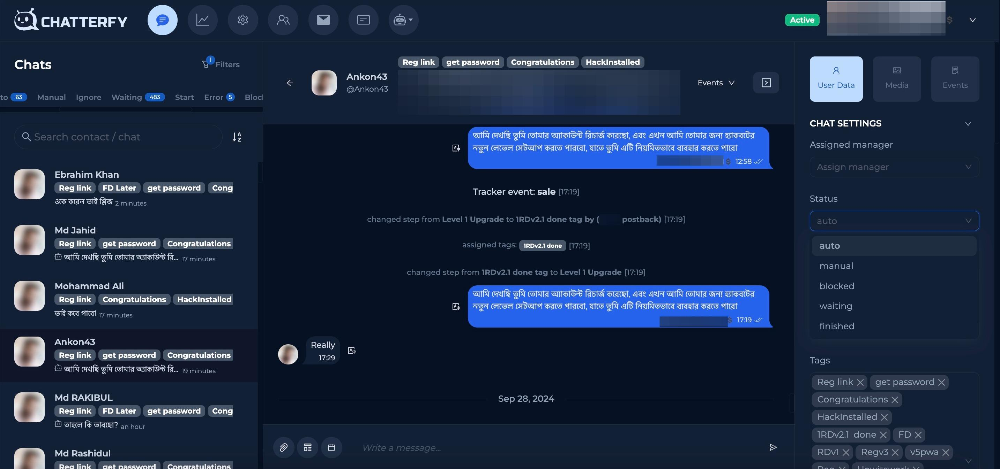

# Статусы

**Статусы** — это действия, которые показывают, на каком этапе общения находится клиент.\

* Для перехода в раздел статусов сначала нажмите Chat Settings&#x20;

<figure><figcaption></figcaption></figure>

* Нажмите на опцию Status и вы увидите выдвижной список

<figure><figcaption></figcaption></figure>

* В списке появятся следующие статусы:\
  \
  **Auto** — это статус, который указывает, что диалог находится в автоматическом режиме, и клиента ведет по воронке флоу ИИ.\
  \
  **Manual** - это статус, который указывает, что диалог находится в ручной обработке. Например, клиент отправил медиа файл и попал в мануал, его следует перевести в авто, чтобы ИИ продолжил вести диалог по флоу. \
  \
  **Blocked** - этот статус присваивается, когда клиент заблокировал бота и бот больше не может отправлять сообщения.\
  \
  **Stopped** - cтатус, когда бот не может писать в чат. Например, когда бот получил ошибку о том, что не может писать первым в чат.\
  \
  **Waiting** - этот статус указывает, что ИИ ожидает ответа от клиента. Диалог не продвинется по флоу до тех пор пока клиент не ответит.\
  \
  **Finished** - этот статус присваивается, когда клиент полностью завершил воронку флоу. В данном случае ИИ отвечать больше не будет.

<figure><figcaption></figcaption></figure>

