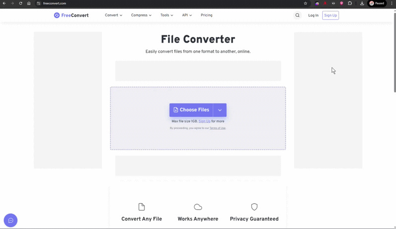

# Как избежать сжатия видео

> ### Видео отправляется сжатым/квадратным, какой допустимый размер ?


Мы рекомендуем загружать видео размером **до 10 МБ**, чтобы оно отображалось и отправлялось корректно. Если файл превышает 10 МБ, Telegram может автоматически переформатировать его, и в результате видео будет отправлено в **искажённом виде**.

\
Мы рекомендуем использовать кодек H.265 - он позволяет значительно уменьшить размер файла без критической потери качества и без дополнительный ресайзов с Вашей стороны.\
Также на нашей платформе разрешенный размер медиа - **до 20 МБ** при отправке медиафайлов (не распространяется на документы).

<a href="https://www.freeconvert.com/download" class="button secondary">Сайт для конвертации</a>


<a href="./" class="button secondary">Частые вопросы</a>
