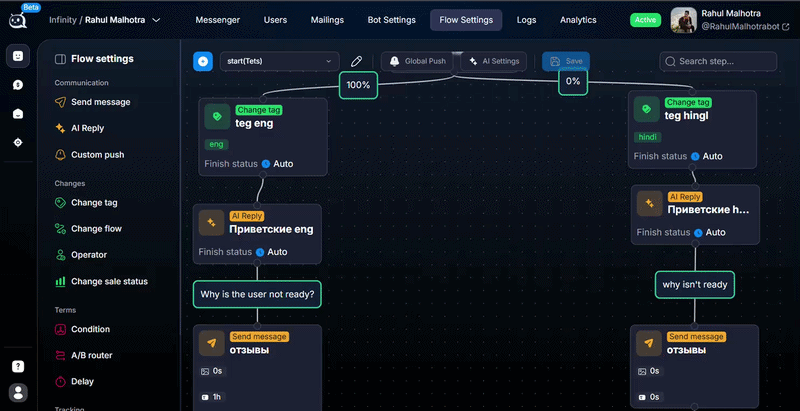

# Как сделать так чтобы бот ждал ответа лида


Можете установить Finish Status на Waiting, а также галочку skip the transition to next step. В таком случае, после перехода на шаг, бот будет ожидать какого-либо ответа от лида прежде, чем повести его далее по воронке.



<a href="./" class="button secondary">Частые вопросы</a>
