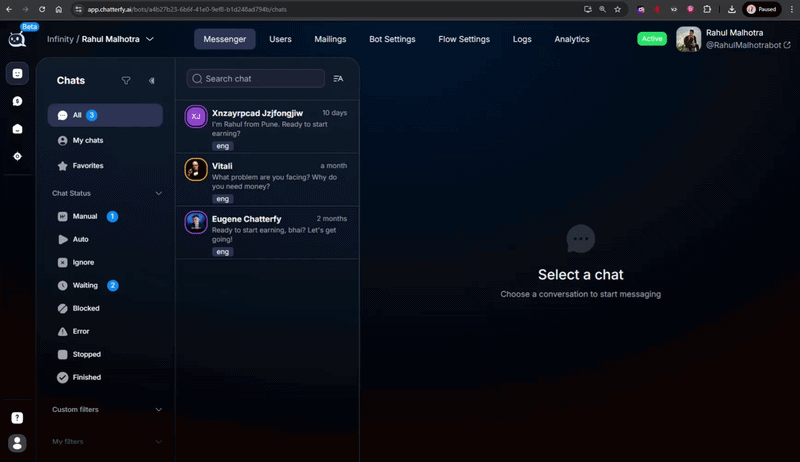

# Как скрыть чаты между операторами

> ### Как сделать так, чтобы операторы не видели чаты друг друга / Как назначить лида на менеджера / Можно ли изолировать лидов по операторам

Для этого, перейдите в настройки бота, в раздел Bot Settings. В блоке Assignment Managers нужно включить галочки:


Show only assigned chat - тогда обработчики смогут видеть только чаты, за которыми закреплены.

\
Show assigned + unassigned chats - смогут видеть неназначенные чаты и за которыми закреплены.



Разделять чаты можно как вручную при их выборе во вкладке Users по кнопке Edit Chats, так и с помощью степа Operator.

<a href="./" class="button secondary">Частые вопросы</a>
