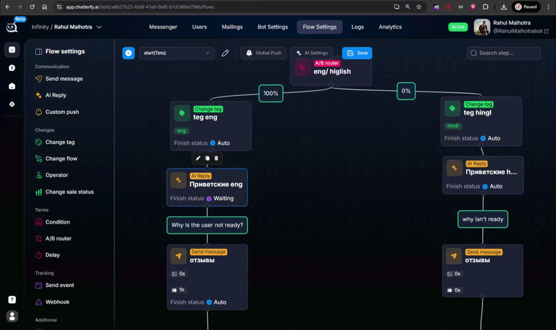

# Как убрать клавиатуру


Чтобы пропадала кнопка, необходимо добавить на какой-либо шаг галочку Hide Keyboard. Его можно сделать промежуточным.



<a href="./" class="button secondary">Частые вопросы</a>
