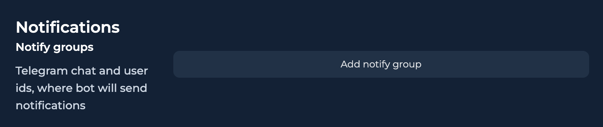
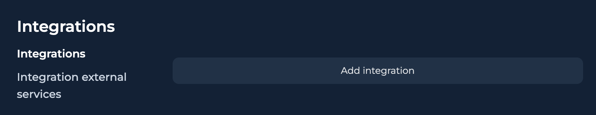

# Global bot settings

**Bot Settings** — это внутренние настройки и описание бота, которые систематизируют работу ИИ. В них можно добавить теги, настроить уровень креативности ответов ИИ, установить время задержки для отправки сообщений, привязать Telegram каналы и тд.&#x20;


Все нужно писать на английском языке: ai settings (global, goal, user restriction, requirement), промпты также на английском.


## 1. Нажмите на значок ⚙️ для перехода в Global Bot Settings

## 2.  Нажмите на кнопку "Activate", чтобы активировать бота.

<figure><figcaption></figcaption></figure>


**Bot Tags** - теги бота (не диалогов). Иcпользуется исключительно для тегирования ботов  для их поиска/фильтрации


## 3. **Delays** - настройка основной задержки перед ответом юзеру.

<figure><figcaption></figcaption></figure>

* **Response time for the lead** - это время, которое пройдет после последнего сообщения от пользователя до запуска степа
* **AI Reply answer speed** - это задержка для Ai Reply, от момента получения последнего сообщения до отправки ответа пользователю (т.е. Response time for the lead + задержка на работу ai)


например, в Response time for the lead стоит 1 минута, а на AI Reply answer speed 1 минута 20 секунд, то это Response time for the lead + 20 секунд


* &#x20;**Send message answer** - это задержка для Send Message, от момента получения последнего сообщения до отправки ответа пользователю
* **Typing speed** - скорость набота текста ИИ

## 4. **Notications -** позволяет добавить функционал нотификаций для групп в TelegramComment

Подробнее: [Нотификации](notifikacii.md)

<figure><figcaption></figcaption></figure>

## 5. **Webhooks & API**  - позволяет использовать вебхуки для внешних сервисов и выполнять определенные дейсвтия в конструкторе.

Подробнее: Входящие запросы (Postbacks)

<figure><figcaption></figcaption></figure>

## 6. **Integrations** - функционал для интеграции со сторонними сервисами

Пример интеграции:&#x20;

<figure><figcaption></figcaption></figure>

## 7. **Custom Fields**&#x20;

**Custom Fields** позволяют вручную создавать кастомные (доп.) поля для переменных или других деталей диалога (например, UserID, ClickID, Deposit\_amount, комментарии и т.д.)


Эти поля могут заполняться как вручную, так и автоматически, отображаться на правой панели диалога и использоваться для работы с лидами и аналитики.


<figure><figcaption></figcaption></figure>


Для создания поля требуется:

* Уникальный ключ поля (любое уникальное название)
* Внутреннее имя поля которое будет отображаться всем сотрудникам
* Тип поля: Текст, Длинный текст, Ссылка, Номер


## 8. **Bot Pit Stop Settings** - условия перехода чата в мануал.

Включите ползунки, при получении которых, ваш диалог автоматически будет переводиться в мануал. Например, клиент отправил вам фото/видео/ аудио/ документ ➡️ диалог перейдет в мануал.

<figure><figcaption></figcaption></figure>

## 9. **Bot tags** - теги воронки


**Bot tags** — это ключевой инструмент для контроля воронки. Он позволяет создавать и редактировать теги для скриптов и этапов воронки. Также можно настроить автоматическое присвоение тегов диалогам на разных стадиях и строить отчеты на их основе.


<figure><figcaption></figcaption></figure>

## 10. Assignment Managers

1. Откройте **Bot Settings** и перейдите в раздел **Assignment managers.**


**Show only assigned chats for operator** - первая настройка активирует фильтрацию конкретных чатов только для присвоенного оператора



**Hide not assign chats for operator** - вторая настройка дополнительно скрывает чаты без ассайна


