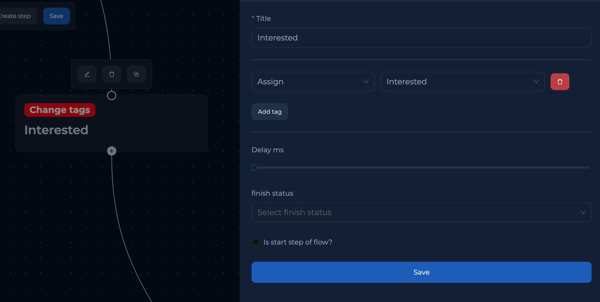

# Change Tags

Добавление или изменение тег диалогов после прохождения блока.

<figure><figcaption></figcaption></figure>


Перед тем как добавлять теги, их нужно создать в общих настройках:[ Bot Tags](../bot-settings/bot-tags.md)


После этого создаем **Change tags** степ и указываем какие теги необходимо присвоить или удалить.

Assign - присвоить тег&#x20;

Remove - удалить тег

**Описание полей:**

* **Title** - название шага.
* **Delay ms** - задержка после выполнения степа. Во время действия задержки - все сообщения от пользователя будут проигнорированы.
* **Finish Status** - в **Change tags** блоке используется только в специфичных ситуациях, стандартно остается пустым.
