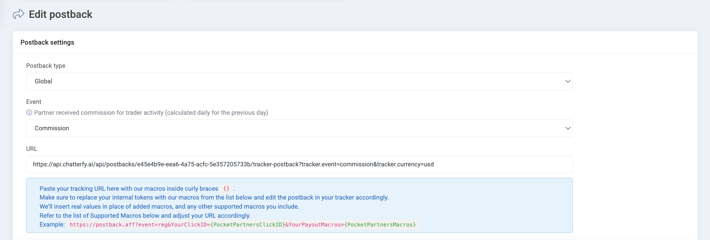

# Pocket Option Postbacks 2.0

Эта инструкция поможет вам шаг за шагом настроить отправку постбеков из Pocket Option Postbacks 2.0 в Chatterfy. Перед тем как настраивать постбеки в Pocket Option, нужно сначала создать интеграцию в Chatterfy.

**Настройка интеграции в Chatterfy**

1. Зайдите в личный кабинет **Chatterfy**.
2. Перейдите в раздел **Трекер → Интеграции**.
3. Найдите и выберите интеграцию **PocketOption RevShare \[v2] NEW.**
4. Нажмите кнопку **Configure**.

<figure><figcaption></figcaption></figure>

\
В настройках укажите, в какой параметр в Pocket вы будете передавать наш `click_id`. Чаще всего используется `click_id`.

<figure><figcaption></figcaption></figure>

**У вас будет 5 конфигураций:**

* **Registration** — событие регистрации на продукте
* **Email Confirmation** — подтверждение email
* **First Deposit**  — событие первого депозита, всегда в $
* **Re-Deposit** — событие повторного депозита, всегда в $
* **Commission (Revshare)** — ваша ревшарная комиссия за этого игрока. Обновляется раз в сутки

**Скопируйте каждую ссылку конфигураций** —  они вам понадобятся на следующем этапе


Внутри каждой ссылки конфигураций есть параметры (кастомные поля, которые автоматически будут созданы внутри СРМ и в которые запишется значение) \
\
Пример: **fields.trader\_id** - Это поле, которое автоматически создастся внутри СРМ (меню диалога с клиентом) в пользовательских полях (Custom Fields).\
\
В это поле автоматически запишется значение (ID клиента), которое нам отдает Pocket Options


<figure><figcaption></figcaption></figure>

Теперь переходим к личному кабинету **Pocket Option**, где нужно создать по одному постбеку на каждое событие.

**Под каждое новое событие вы создаете отдельную ссылку. Вот примеры ссылок, которые нужно использовать:**

<figure><figcaption></figcaption></figure>

Теперь переходим к личному кабинету **Pocket Option**, где нужно создать по одному постбеку на каждое событие.

**Пример: настройка события Сomission**

1. Откройте раздел постбеков в Pocket Option.
2. Нажмите **добавить постбек**.
3. В поле **URL** вставьте соответствующую ссылку (в нашем примере — ссылка для события `Сomission`)

<figure><figcaption>
Часть 1
</figcaption></figure>

<figure><figcaption>
Часть 2
</figcaption></figure>

<figure><figcaption>
Часть 3
</figcaption></figure>

### ‼️‼️‼️ Заполните поля в соответствии с примерами на скриншотах ‼️‼️‼️

**Настройка события `Registration`**

Настраивается аналогично скриншоту предоставленному ниже:

1. Откройте раздел постбеков в Pocket Option.
2. Нажмите **добавить постбек**.
3. В поле **URL** вставьте соответствующую ссылку (в нашем примере — ссылка для события `registration`).

<figure><figcaption>
Часть 1
</figcaption></figure>

Заполните поля в соответствии с примерами на скриншотах:

<figure><figcaption>
Часть 2
</figcaption></figure>

<figure><figcaption>
Часть 3
</figcaption></figure>

После этого Pocket Option выдаст вам **партнёрскую ссылку для клиента (скопируйте ее как указано на скриншоте ниже)**.

<figure><figcaption></figcaption></figure>

Затем в **Chatterfy**, в разделе **Трекер → Интеграции**, вставьте полученную ссылку в поле **Registration links**, следуя примеру ниже.

В результате вы получите **готовую ссылку с автоматически подставленным макросом**. Эту ссылку вы сможете использовать в своих скриптах для корректной передачи `click_id`.

<figure><figcaption></figcaption></figure>

Обратите внимание, как вставлять click\_id:

* Если параметр один: `?click_id={{tracker.clickid}}`
* Если параметров несколько, добавляйте через `&`:&#x20;

Пример: [`https://pocketcustomer.com/register?utm_campaign=764984&utm_source=affiliate&code=JOINHERE123&click_id={{tracker.clickid}}`](https://pocketcustomer.com/register?utm_campaign=764984\&utm_source=affiliate\&code=JOINHERE123\&click_id=\{{tracker.clickid\}})

**Настройка события `Email Confirmation`**

Настраивается аналогично скриншоту предоставленному ниже:

<figure><figcaption>
Часть 1 
</figcaption></figure>

<figure><figcaption>
Часть 2 
</figcaption></figure>

<figure><figcaption>
Часть 3 
</figcaption></figure>

**Настройка события `First Deposit`**&#x20;

Так же, настраивается аналогично скриншоту предоставленным ниже: Только используйте соответствующую ссылку с параметром `currency=usd`:\

<figure><figcaption>
Часть 1 
</figcaption></figure>

<figure><figcaption>
Часть 2 
</figcaption></figure>

<figure><figcaption>
Часть 3
</figcaption></figure>

**Настройка события `Re-deposit`**

Cледуйте скриншотам ниже. Используйте соответствующую ссылку с параметром `currency=usd`:

<figure><figcaption>
Часть 1
</figcaption></figure>

<figure><figcaption>
Часть 2 
</figcaption></figure>

<figure><figcaption>
Часть 3
</figcaption></figure>

**Настройка события `Withdrawal`**&#x20;

Cледуйте скриншотам ниже:

<figure><figcaption>
Часть 1 
</figcaption></figure>

<figure><figcaption>
Часть 2
</figcaption></figure>

<figure><figcaption>
Часть 3
</figcaption></figure>

**✅ ФИНАЛЬНЫЙ ЭТАП -** ‼️‼️‼️ **САМЫЙ ВАЖНЫЙ** ‼️‼️‼️

**Проверка после настройки:**

* Совершите тестовую регистрацию.
* **Убедитесь, что события отображаются в Chatterfy (Tracker - Postback Logs) ‼️**
* Если что-то не работает — проверьте правильность вставки click\_id и соответствие ссылок.

